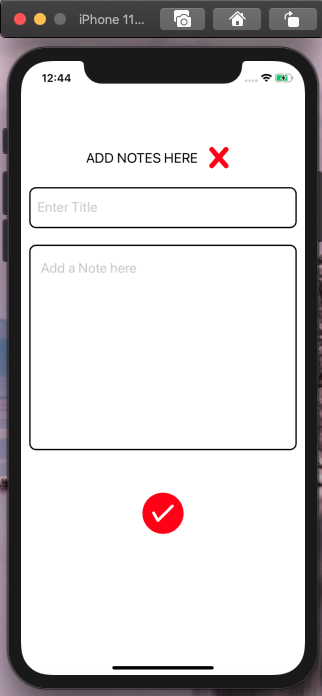
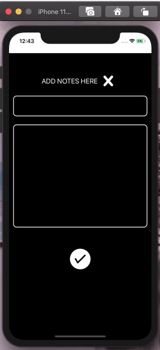
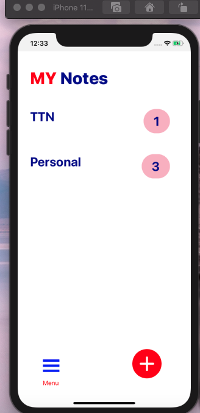
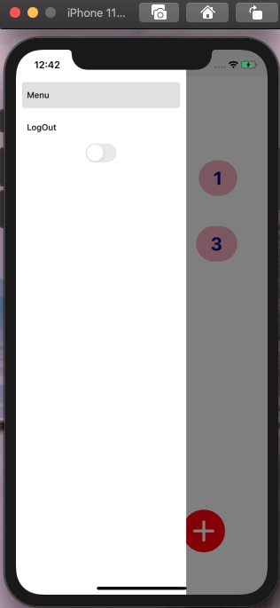

THIRD ASSESSMENT

{:height="20%" width="20%"}
{:height="20%" width="50%"}
{:height="20%" width="50%"}
{:height="20%" width="50%"}
{:height="20%" width="50%"}
{:height="20%" width="50%"}
{:height="20%" width="50%"}
{:height="20%" width="50%"}
{:height="20%" width="50%"}
